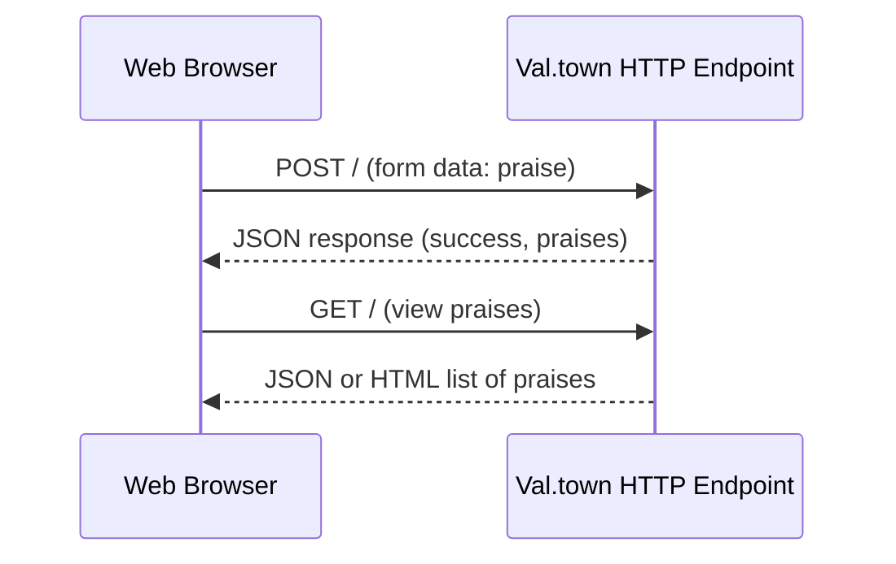
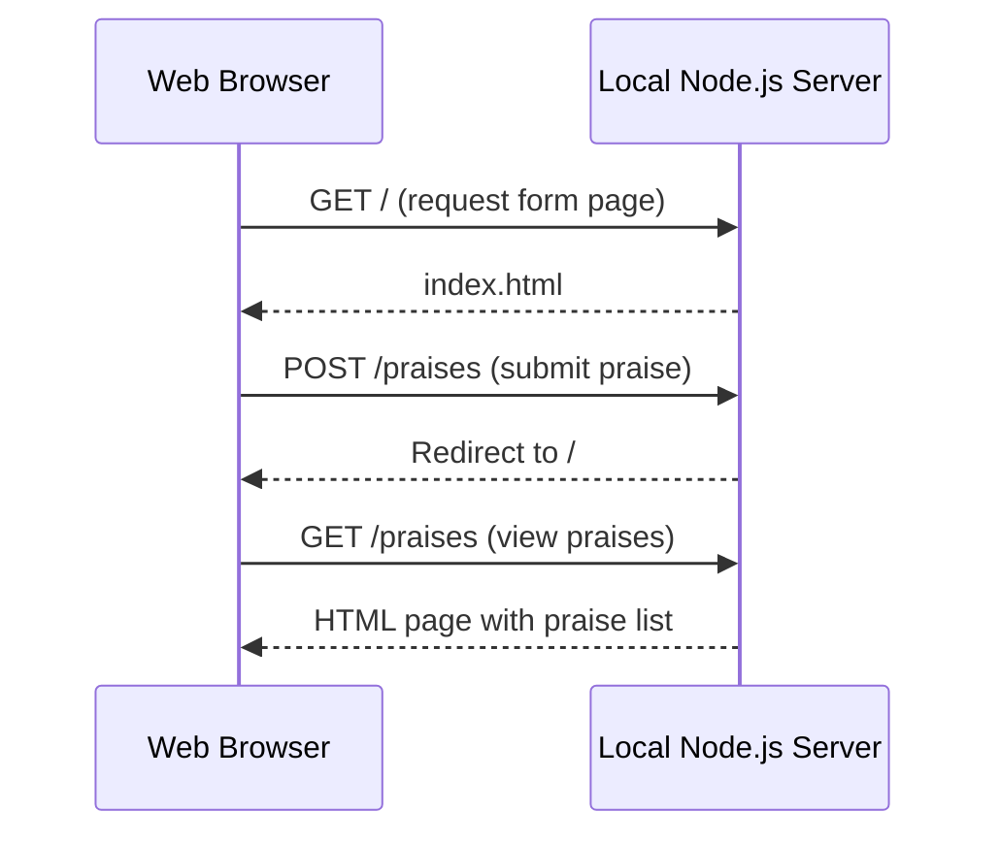
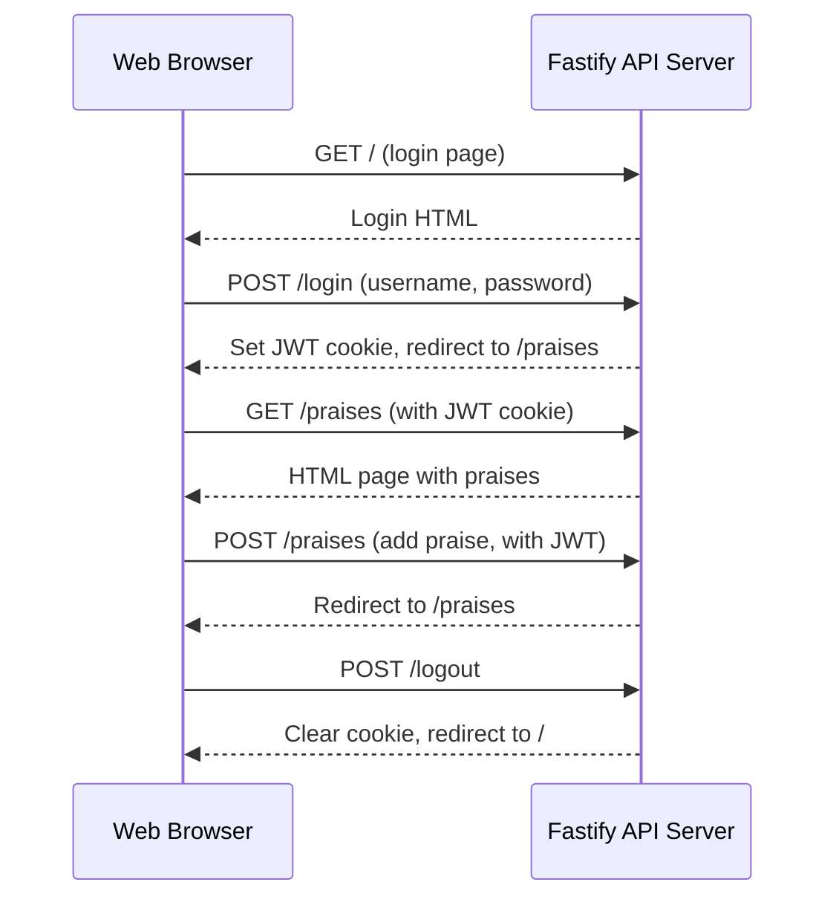
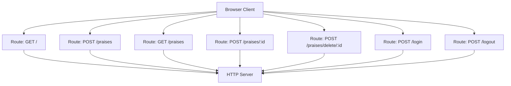
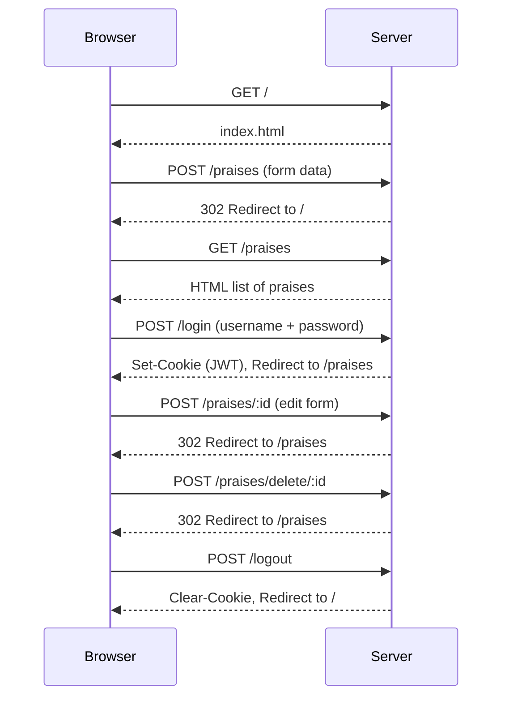

# praise-cage-rest-api-workshop
Norfolk JS 2025 Workshop on REST APIs

## Table of Contents

1. [Prerequisites](#1-prerequisites)
2. [Workshop Timeline](#2-workshop-timeline)
3. [Getting Started with HTML and an HTTP Endpoint](#3-getting-started-with-html-and-an-http-endpoint)
    - [3a. Create a Codespace](#3a-create-a-codespace)
    - [3b. Set Up a Val.town Account](#3b-set-up-a-valtown-account)
4. [Create a Static HTML Page with a `<form>` Element to POST](#4-create-a-static-html-page-with-a-form-element-to-post)
    - [4a. Create index.html](#4a-create-indexhtml)
    - [4b. Serve Your Static HTML](#4b-serve-your-static-html)
    - [4c. Create a Val.town HTTP Endpoint to Receive Form-Encoded Data and Respond with JSON](#4c-create-a-valtown-http-endpoint-to-receive-form-encoded-data-and-respond-with-json)
    - [4d. Checkpoint 1: Form Submission](#4d-checkpoint-1-form-submission)
    - [4e. View JSON Response in the Browser](#4e-view-json-response-in-the-browser)
    - [4f. No Client-Side JavaScript Required to Send Data](#4f-no-client-side-javascript-required-to-send-data)
    - [4g. Update Val Town HTTP Endpoint to Return a Redirect to an HTML Page](#4g-update-val-town-http-endpoint-to-return-a-redirect-to-an-html-page)
    - [4h. Use HTML Page to Issue a GET Request to the Val Town HTTP Endpoint](#4h-use-html-page-to-issue-a-get-request-to-the-val-town-http-endpoint)
    - [4i. Update Val Town HTTP Endpoint to Return HTML Instead of JSON](#4i-update-val-town-http-endpoint-to-return-html-instead-of-json)
    - [4j. Checkpoint 2: Server Rendering](#4j-checkpoint-2-server-rendering)
5. [Build Our Own Server](#5-build-our-own-server)
    - [5a. Setting Up Static File Serving](#5a-setting-up-static-file-serving)
    - [5b. Running the Static Server](#5b-running-the-static-server)
    - [5c. Transitioning to a Local Development Server](#5c-transitioning-to-a-local-development-server)
    - [5d. Adding API Functionality](#5d-adding-api-functionality)
    - [5e. Switching Endpoints](#5e-switching-endpoints)
    - [5f. Checkpoint 3: Local API Server](#5f-checkpoint-3-local-api-server)
6. [Add Authentication Hooks with Different Architecture](#6-add-authentication-hooks-with-different-architecture)
    - [6a. Install Dependencies](#6a-install-dependencies)
    - [6b. Create Fastify Server with Authentication](#6b-create-fastify-server-with-authentication)
    - [6c. Checkpoint 4: Authentication](#6c-checkpoint-4-authentication)
    - [6d. Security Considerations](#6d-security-considerations)
7. [API Reference](#7-api-reference)
8. [Troubleshooting Tips](#8-troubleshooting-tips)
9. [Workshop Recap: What We've Built](#9-workshop-recap-what-weve-built)
10. [What We Accomplished](#10-what-we-accomplished)
11. [Extension Challenges](#11-extension-challenges)
12. [Further Learning Topics](#12-further-learning-topics)

---

## 1. Prerequisites
- Basic JavaScript knowledge
- Familiarity with HTML forms
- Understanding of HTTP requests (GET/POST)
- Node.js installed on your machine

## 2. Workshop Timeline
- Getting Started (15 min)
- Creating a Static HTML Form (20 min)
- Building Our Own Server (30 min)
- Adding Authentication (30 min)
- Finish full CRUD features (15 min)

## 3. Getting Started with HTML and an HTTP Endpoint

### 3a. Create a Codespace
1. Fork this repository.  
2. In your forked repo, go to **Code → Codespaces** and create a new Codespace.  
3. This gives you an online dev environment to edit and run the project.

### 3b. Set Up a Val.town Account
1. Go to [Val.town](https://val.town) and sign in with your **GitHub account**.  
2. Create a new **HTTP val** to handle form submissions.  
3. Copy your Val.town function's **endpoint URL**—you'll use this in your `index.html` form.

Once set up, you'll use **Val.town as your backend** and **Codespaces as your workspace**. 🚀

## 4. Create a Static HTML Page with a `<form>` Element to POST

### 4a. Create index.html

Create a `/public/index.html` file and add the following code:

```html
<!DOCTYPE html>
<html>
<head>
  <title>Praise Cage REST API Workshop</title>
</head>
<body>
  <h1>Submit a Praise</h1>
  <form action="https://<VALTOWNUSER>-<VALTOWNFUNCTION>.web.val.run" method="POST"> <!-- update with your HTTP endpoint URL -->
    <label for="praise">Enter Praise:</label>
    <input type="text" name="praise" id="praise" required />
    <button type="submit">Submit</button>
  </form>
</body>
</html>
```

### 4b. Serve Your Static HTML

Serve your static HTML with `npx live-server` in the console. Hit 'Y' to accept downloading, if it asks, first time only. Make note of the proxy URL Codespaces generates for you. It is available as an HTTPS link in your Codespaces terminal.

### 4c. Create a Val.town HTTP Endpoint to Receive Form-Encoded Data and Respond with JSON

Create a new HTTP Val in Val Town and add the following code:

```js
import { blob } from "https://esm.town/v/std/blob";

export default async function(request: Request) {
  const BLOB_KEY = "stored-praises";

  // Retrieve stored praises or initialize to empty array
  const stored = (await blob.getJSON(BLOB_KEY)) ?? [];
  // Ensures Blob JSON is an array
  const praises = Array.isArray(stored) ? stored : [];

  if (request.method === "GET") {
    return Response.json(praises);
  }

  if (request.method === "POST") {
    const formData = await request.formData();
    const praise = formData.get("praise");

    if (typeof praise === "string" && praise.trim() !== "") {
      praises.push(praise);
      await blob.setJSON(BLOB_KEY, praises);
    }

     // Return JSON response
    return Response.json({
      success: true,
      praises,
    });
  }

  return Response.json({ error: "Method not allowed." }, { status: 405 });
}
```
The docs for Val.town blob interface is here: https://docs.val.town/std/blob/

You can fork your own blob admin from here: https://www.val.town/v/stevekrouse/blob_admin

### 4d. Checkpoint 1: Form Submission
- Submit a form entry - you should see a JSON response with your praise
- The form should work without any client-side JavaScript

### 4e. View JSON Response in the Browser
- After submitting a form entry, the page will display JSON output with all recorded praises.
- Open the endpoint URL in a browser (`GET` request) to view stored praises in JSON format.

### 4f. No Client-Side JavaScript Required to Send Data
- The form submission works **without JavaScript**.
- The browser directly handles sending form data to the Val Town API.
- The browser has only two methods for <form> elements, GET and POST
- POST requests contain form-encoded data

### 4g. Update Val Town HTTP Endpoint to Return a Redirect to an HTML Page

Modify the Val Town function to redirect users back to the form page after submitting a praise:

```js
import { blob } from "https://esm.town/v/std/blob";

export default async function(request: Request) {
  const BLOB_KEY = "stored-praises";

  // Retrieve stored praises or initialize to empty array
  const stored = (await blob.getJSON(BLOB_KEY)) ?? [];
  const praises = Array.isArray(stored) ? stored : [];

  if (request.method === "GET") {
    return Response.json(praises);
  }

  if (request.method === "POST") {
    const formData = await request.formData();
    const praise = formData.get("praise");

    if (typeof praise === "string" && praise.trim() !== "") {
      praises.push(praise);
      await blob.setJSON(BLOB_KEY, praises);
    }

    // Redirect user to form page
    return new Response(null, {
      status: 302,
      headers: {
        Location: "https://<YOUR_GITHUB_PROXY_URL>.app.github.dev/public/",
      },
    });
  }

  return Response.json({ error: "Method not allowed." }, { status: 405 });
}
```

### 4h. Use HTML Page to Issue a GET Request to the Val Town HTTP Endpoint

Add a new button to `index.html` for issuing a GET request for all stored praises as JSON:

```html
<form action="https://<VALTOWNUSER>-<VALTOWNFUNCTION>.web.val.run" method="GET">
  <button type="submit">View Praises</button>
</form>
```

### 4i. Update Val Town HTTP Endpoint to Return HTML Instead of JSON

Modify the Val Town function to return an HTML page instead of JSON:

```js
  if (request.method === 'GET') {
    // Return HTML with praises
    const htmlContent = `
      <!DOCTYPE html>
      <html>
      <head><title>Server Rendered Praises</title></head>
      <body>
        <h1>Praise List</h1>
        <ul>
          ${praises.map(p => `<li>${p}</li>`).join('')}
        </ul>
        <a href="/">Go back</a> <!-- Update with actual form page URL -->
      </body>
      </html>
    `;
    return new Response(htmlContent, {
      headers: { "Content-Type": "text/html" }
    });
  }
```
Congratulations, you now have a server rendered page!

### 4j. Checkpoint 2: Server Rendering
- Click "View Praises" button - you should see an HTML page with your praises
- Submit a new praise - you should be redirected back to your form




---

You can copy and paste these diagrams directly into your README.md in Mermaid code blocks. Let me know if you want additional detail or another type of diagram!

## 5. Build Our Own Server

This section will guide you step-by-step in building your Node.js server, starting simple and evolving into a RESTful endpoint. Each code snippet is a full working version of `server.js` for that stage—copy and replace your file each time.

### 5a. Initial Version: Serve Static HTML Only

Create a file called `server.js`:

```js
// 5a. Initial version: Only serves the static HTML form at "/"
const http = require('http');
const fs = require('fs');
const path = require('path');

const server = http.createServer((req, res) => {
  if (req.method === 'GET' && req.url === '/') {
    fs.readFile(path.join(__dirname, '/public/index.html'), (err, data) => {
      if (err) {
        res.writeHead(500, { 'Content-Type': 'text/plain' });
        res.end('Internal Server Error');
      } else {
        res.writeHead(200, { 'Content-Type': 'text/html' });
        res.end(data);
      }
    });
    return;
  }
  // All other requests get a 404
  res.writeHead(404, { 'Content-Type': 'text/plain' });
  res.end('Not Found');
});

server.listen(3000, () => {
  console.log('Server running at http://localhost:3000');
});
```

> **Checkpoint:**  
> - Visit `/` in your browser to see the HTML form.  
> - All other URLs will return 404.

---

### 5b. Add GET `/praises` Endpoint (Static Response)

Add a new GET `/praises` endpoint to serve a static HTML page (no praises yet).

Replace `server.js` with:

```js
// 5b. Static GET /praises endpoint added
const http = require('http');
const fs = require('fs');
const path = require('path');

const server = http.createServer((req, res) => {
  if (req.method === 'GET' && req.url === '/') {
    fs.readFile(path.join(__dirname, '/public/index.html'), (err, data) => {
      if (err) {
        res.writeHead(500, { 'Content-Type': 'text/plain' });
        res.end('Internal Server Error');
      } else {
        res.writeHead(200, { 'Content-Type': 'text/html' });
        res.end(data);
      }
    });
    return;
  }

  if (req.method === 'GET' && req.url === '/praises') {
    // Static page: no praises yet
    const htmlContent = `
      <!DOCTYPE html>
      <html>
      <head><title>Praise List</title></head>
      <body>
        <h1>All Praises</h1>
        <ul>
          <li>No praises yet.</li>
        </ul>
        <a href="/">Go Back</a>
      </body>
      </html>
    `;
    res.writeHead(200, {
      'Content-Type': 'text/html',
      'Content-Length': Buffer.byteLength(htmlContent),
      'Connection': 'close'
    });
    res.end(htmlContent);
    return;
  }

  // All other requests get a 404
  res.writeHead(404, { 'Content-Type': 'text/plain' });
  res.end('Not Found');
});

server.listen(3000, () => {
  console.log('Server running at http://localhost:3000');
});
```

> **Checkpoint:**  
> - Visit `/` for the form, `/praises` for the (static) list.

---

### 5c. Add In-Memory Storage and POST `/praises` (Dynamic)

Store praises in memory and let users POST them via the form.

Replace the entire file with:

```js
// 5c. Dynamic GET /praises and POST /praises with in-memory storage
const http = require('http');
const fs = require('fs');
const path = require('path');
const { URLSearchParams } = require('url');

let praises = []; // In-memory storage

const server = http.createServer((req, res) => {
  if (req.method === 'GET' && req.url === '/') {
    fs.readFile(path.join(__dirname, '/public/index.html'), (err, data) => {
      if (err) {
        res.writeHead(500, { 'Content-Type': 'text/plain' });
        res.end('Internal Server Error');
      } else {
        res.writeHead(200, { 'Content-Type': 'text/html' });
        res.end(data);
      }
    });
    return;
  }

  if (req.method === 'GET' && req.url === '/praises') {
    // Show all praises from memory (or "No praises yet")
    const htmlContent = `
      <!DOCTYPE html>
      <html>
      <head><title>Praise List</title></head>
      <body>
        <h1>All Praises</h1>
        <ul>
          ${praises.length > 0
            ? praises.map(p => `<li>${p}</li>`).join('')
            : '<li>No praises yet.</li>'}
        </ul>
        <a href="/">Go Back</a>
      </body>
      </html>
    `;
    res.writeHead(200, {
      'Content-Type': 'text/html',
      'Content-Length': Buffer.byteLength(htmlContent),
      'Connection': 'close'
    });
    res.end(htmlContent);
    return;
  }

  if (req.method === 'POST' && req.url === '/praises') {
    // Handle form POST and store praise in memory
    let body = '';
    req.on('data', chunk => {
      body += chunk.toString();
    });
    req.on('end', () => {
      const formData = new URLSearchParams(body);
      const praise = formData.get('praise');
      if (praise) {
        praises.push(praise);
      }
      // Redirect back to form after submission
      res.writeHead(302, { 'Location': '/' });
      res.end();
    });
    return;
  }

  // All other requests get a 404
  res.writeHead(404, { 'Content-Type': 'text/plain' });
  res.end('Not Found');
});

server.listen(3000, () => {
  console.log('Server running at http://localhost:3000');
});
```

> **Checkpoint:**  
> - Submitting the form on `/` (POST) now saves a praise in memory.  
> - `/praises` now displays all entered praises (until the server restarts).

---

### 5d. Switching Your HTML Form Between Val Town and Local Server

As you transition from using Val Town to your local Node.js server, you need to update your `/public/index.html` form actions.

**When using Val Town as your backend:**

```html
<form action="https://<VALTOWNUSER>-<VALTOWNFUNCTION>.web.val.run" method="POST">
  <label for="praise">Enter Praise:</label>
  <input type="text" name="praise" id="praise" required />
  <button type="submit">Submit</button>
</form>
```

**Once your Node.js server is running and can accept POSTs to `/praises`, update your form to:**

```html
<form action="/praises" method="POST">
  <label for="praise">Enter Praise:</label>
  <input type="text" name="praise" id="praise" required />
  <button type="submit">Submit</button>
</form>
```

If you have a “View Praises” button, update that as well:

- For Val Town:  
  `<form action="https://<VALTOWNUSER>-<VALTOWNFUNCTION>.web.val.run" method="GET">`
- For your local server:  
  `<form action="/praises" method="GET">`
  
---

**Tip:**  
When using Codespaces, open the “Ports” tab to get the public URL for your running server if you want to test from your browser.

---

### 5e. Summary Table

| File Version | GET /           | GET /praises           | POST /praises           |
|--------------|-----------------|------------------------|-------------------------|
| 5a           | HTML form       | 404                    | 404                     |
| 5b           | HTML form       | Static HTML page       | 404                     |
| 5c           | HTML form       | Dynamic praise list    | Stores praise in memory |


---

**Tip:**  
Always copy and replace your entire `server.js` with each new version above to avoid confusion and ensure smooth progression.

---

## 6. Add Authentication Hooks with Different Architecture

We will now add an authentication layer to our API using JWTs. To handle the new complexity, we can move to a framework that implements some request/response lifecycle hooks. This means the framework does some of the heavy lifting for us.

### 6a. Install Dependencies
```bash
npm init -y
npm install fastify @fastify/cookie @fastify/formbody @fastify/jwt
```

### 6b. Create Fastify Server with Authentication

Replace your `server.js` code with the following: 

```js
const Fastify = require('fastify');
const fastifyCookie = require('@fastify/cookie');
const fastifyFormBody = require('@fastify/formbody');
const fastifyJwt = require('@fastify/jwt');

const fastify = Fastify({ logger: true });

// Register plugins
fastify.register(fastifyCookie, { secret: 'cookie-secret' });
fastify.register(fastifyFormBody);
fastify.register(fastifyJwt, { secret: 'supersecretkey' });

// Mock user database
const users = {
  nic: { password: 'praisecage!' },
  travolta: { password: 'thedevil666' }
};

// In-memory data store
let praises = [];

// Login page route
fastify.get('/', async (req, res) => {
  res.type('text/html').send(`
    <!DOCTYPE html>
    <html>
    <head><title>Login</title></head>
    <body>
      <h1>Praise Cage REST API Workshop</h1>
      <h2>Login</h2>
      <form action="/login" method="POST">
        <input type="text" name="username" placeholder="Username" required>
        <input type="password" name="password" placeholder="Password" required>
        <button type="submit">Login</button>
      </form>
    </body>
    </html>
  `);
});

// Login authentication route
fastify.post('/login', async (req, res) => {
  const { username, password } = req.body;
  
  // Validate credentials
  if (!users[username] || users[username].password !== password) {
    return res.status(401).type('text/html').send('<h1>Invalid username or password</h1><a href="/">Go Back</a>');
  }

  // Create JWT token
  const token = fastify.jwt.sign({ username });

  // Set cookie and redirect
  res
    .setCookie('token', token, { httpOnly: true, secure: true, sameSite: 'Strict' })
    .redirect('/praises');
});

// Authentication middleware
fastify.addHook('onRequest', async (req, res) => {
  if (req.url.startsWith('/praises')) {
    try {
      const token = req.cookies.token;
      if (!token) throw new Error();
      req.user = fastify.jwt.verify(token);
    } catch (err) {
      res
        .type('text/html')
        .status(401)
        .send(`
          <!DOCTYPE html>
          <html>
          <head><title>Unauthorized</title></head>
          <body>
            <h1>Unauthorized</h1>
            <p>You must be logged in to access this page.</p>
            <a href="/">Login</a>
          </body>
          </html>
        `);
    }
  }
});

// View and add praises route
fastify.get('/praises', async (req, res) => {
  res.type('text/html').send(`
    <!DOCTYPE html>
    <html>
    <head><title>Fastify Backed Praises</title></head>
    <body>
      <h1>Submit a Praise</h1>
      <form action="/praises" method="POST">
        <input type="text" name="praise" placeholder="Enter Praise" required>
        <button type="submit">Submit</button>
      </form>

      <h2>All Praises</h2>
      <ul>
        ${praises
          .map(
            (p, index) => `
            <li>
              <form action="/praises/${index}" method="POST">
                <input type="text" name="updated_praise" value="${p}" required>
                <button type="submit">Update</button>
              </form>

              <form action="/praises/delete/${index}" method="POST">
                <button type="submit">Delete</button>
              </form>
            </li>
          `
          )
          .join('')}
      </ul>

      <form action="/logout" method="POST">
        <button type="submit">Logout</button>
      </form>
    </body>
    </html>
  `);
});

// Add a new praise
fastify.post('/praises', async (req, res) => {
  const { praise } = req.body;
  if (!praise) return res.status(400).type('text/html').send('<h1>Praise is required</h1><a href="/praises">Go Back</a>');

  praises.push(praise);
  res.redirect('/praises');
});

// Update existing praise
fastify.post('/praises/:id', async (req, res) => {
  const { id } = req.params;
  const { updated_praise } = req.body;
  const index = parseInt(id, 10);

  if (!updated_praise) {
    return res.status(400).type('text/html').send('<h1>Praise is required</h1><a href="/praises">Go Back</a>');
  }
  // ensure `index` is a valid number and within array bounds
  if (!isNaN(index) && index >= 0 && index < praises.length) {
    praises[index] = updated_praise;
  }

  res.redirect('/praises');
});

// Delete praise
fastify.post('/praises/delete/:id', async (req, res) => {
  const { id } = req.params;
  const index = parseInt(id, 10);

  if (!isNaN(index) && index >= 0 && index < praises.length) {
    praises.splice(index, 1);
  }

  res.redirect('/praises');
});

// Logout route
fastify.post('/logout', async (req, res) => {
  res
    .clearCookie('token', { path: '/' })
    .redirect('/');
});

// Start the server
fastify.listen({ port: 3000, host: '0.0.0.0' }, (err, address) => {
  if (err) throw err;
  console.log(`Server running at ${address}`);
});
```

### 6c. Checkpoint 4: Authentication
- Test login with credentials: username "nic", password "praisecage!"
- Add, update, and delete praises
- Try logging out and back in

### 6d. Security Considerations
- The JWT has no expiration - consider adding `expiresIn` to the token
- Passwords are stored in plaintext - use hashing in real applications
- All users share the same data - add user-specific data separation

## 7. API Reference

| Endpoint            | Method | Description                | Auth Required |
|---------------------|--------|----------------------------|---------------|
| /                   | GET    | Show login page            | No            |
| /login              | POST   | Authenticate user          | No            |
| /praises            | GET    | View all praises           | Yes           |
| /praises            | POST   | Add a new praise           | Yes           |
| /praises/:id        | POST   | Update a praise by ID      | Yes           |
| /praises/delete/:id | POST   | Delete a praise by ID      | Yes           |
| /logout             | POST   | Log user out               | Yes           |

## 8. Troubleshooting Tips

- If you see "Cannot GET /praises" - Check your route spelling and server restart
- JWT verification fails - Ensure cookie is being set properly
- Form submission doesn't work - Verify your action URL and method
- If localhost doesn't work in Codespaces, try using the full GitHub proxy URL

## 9. Workshop Recap: What We've Built

```
┌─────────────────┐    HTTP Request    ┌─────────────────┐
│                 │ ─────────────────► │                 │
│                 │                    │                 │
│   Web Browser   │                    │   REST Server   │
│                 │                    │                 │
│                 │ ◄───────────────── │                 │
└─────────────────┘    HTTP Response   └─────────────────┘
```

At its core, the modern web is built on a simple, powerful pattern: **a client makes a request, and a server responds**. This fundamental model — often referred to as **client-server architecture** — has remained the backbone of networked computing since the earliest days of the internet.

This workshop gave us hands-on experience building software that embraces that model, from the ground up:

### 🌐 The Client-Server Model

We built a **web client** — an HTML form in a browser — that communicates with a **server** via HTTP requests. The browser acts as a **client**, initiating actions like submitting a form (`POST`) or requesting data (`GET`). The server listens for those requests, processes them, and sends back responses — either HTML pages or JSON data.

This pattern powers everything from blogs and web apps to APIs and microservices. Whether it's your browser loading a site or your phone fetching weather data, it’s always about structured communication between clients and servers.

### 🔁 The Request-Response Cycle

HTTP (Hypertext Transfer Protocol) defines **how** the client and server talk. It’s a stateless protocol — each request is independent. Here’s what happens in every cycle:

1. **Request**:

   * The browser sends a request to a server with a specific HTTP method (`GET`, `POST`, etc.).
   * It may include headers, form data, cookies, or query parameters.

2. **Response**:

   * The server sends back a response with a status code (e.g., 200 OK, 404 Not Found).
   * It includes a body (HTML, JSON, etc.) and headers like `Content-Type`.

By building both sides of this flow — a form that submits and a server that responds — we demystified what’s happening every time you load a webpage or call an API.

### 📜 The Protocols Beneath the Web

HTTP is just one layer in the **stack of protocols** that make the internet work. It sits on top of:

* **TCP/IP**: The low-level transport protocols that move packets across networks.
* **DNS**: Resolves domain names to IP addresses so we can type `example.com` instead of `93.184.216.34`.
* **TLS/HTTPS**: Encrypts traffic to keep it secure from snooping.

These protocols were developed decades ago as part of foundational internet research, and they continue to evolve — but the principles remain the same.





We used this workshop to recreate the classic **web roundtrip** with:

* Static file serving
* Form submission (POST)
* Dynamic data rendering (GET)
* A simple API endpoint that returns JSON
* Stateless authentication using JWT
* A real-world example of how the browser interacts with servers

We didn’t just learn web dev tools — we practiced how **networked computers communicate** using shared conventions and open protocols. These are the same foundations that scale up to the largest systems on Earth.

## 10. 🔥 **THE REAL TAKEAWAY: NOUVEAU SHAMANIC EDITION** 🔥

Through the sacred rites of request and response, you have channeled the spirit of Cage. Praise Cage!

🌀 **You began with silence** — an empty HTML form whispered into the browser void. But with one click, your `POST` cast a spell across the wires, invoking a Val.town endpoint like a mystical beacon.

🐍 **You then shed your first skin** — casting off external dependencies, you conjured a Node.js server with your own hands. A ritual of sockets and buffers. You, now, were the endpoint.

🦾 **Next, you imbued verbs with power** — `GET` no longer fetched lifeless files. It sang praises from the in-memory void. `POST` transmuted human praise into server-side data. These were no longer HTTP methods. They were **incantations**.

🛡️ **Then came the guardians** — JWTs and cookies stood watch over your routes, ensuring only the worthy could pass. Fastify, your middleware totem, gave you hooks and interceptors — *middleware chakras* — to bend the flow of traffic to your will.

🧙‍♂️ **At last, you saw it** — REST not as a constraint, but a **ritual language**. Stateless. Predictable. Sacred. A RESTful API is not just a tool. It is a **ceremony of trust** between client and server.

### A Blessing:

You didn’t just build a REST API —
You **felt** the layers.
You **unwrapped** the magic.
You saw that every abstraction — Val.town, Node, Fastify — is built on timeless, **simple truths**:
💡 A client asks. A server answers.

May your caches update and your DNS Resolve!~!~! 
Praise Cage!

- Serve static HTML
- HTML `<forms>` element
- HTTP methods
  - `GET`
  - `POST`
- External API Endpoints
  - Webhooks
  - Returning JSON
  - Returning HTML
- Server-side rendering
- Build a standalone server
- Stateless auth sessions with JWT
- Server-side routing
- RESTful API Design
  - CRUD functionality (Create, Read, Update, Delete)

## 11. Extension Challenges

1. **Add User-Specific Data**
   - Modify the server to store praises separately for each user

2. **Add a Database**
   - Replace in-memory storage with SQLite or JSON file persistence 

3. **Implement Token Refresh**
   - Add token expiration and implement a refresh mechanism

4. **Add Client-Side JavaScript**
   - Use `fetch()` to create a more dynamic UI without page reloads

## 12. Further Learning Topics
- Information Architecture for better documentation
- Client side JavaScript
  - `fetch()` API
  - URL Parameters
    - Query Strings
    - Path Parameters
- User Management
  - Roles 
  - Permissions
  - OAuth
- Persistent Data
  - Databases
  - Flat file lookups
- "Real Time" Updates
  - WebSockets
  - Server Sent Events
- SPA vs MPA
  - Client vs server responsibilities
- Alternatives to REST
  - GraphQL
  - tRPC
  - MCP (Model Context Protocol)
- Deployment and Operation Models
  - Monolith
  - Microservice
  - CI/CD
    - build, test, deploy application and service pipelines
    - automated operations, logging, monitoring, tracing
  - Infrastructure as Code
